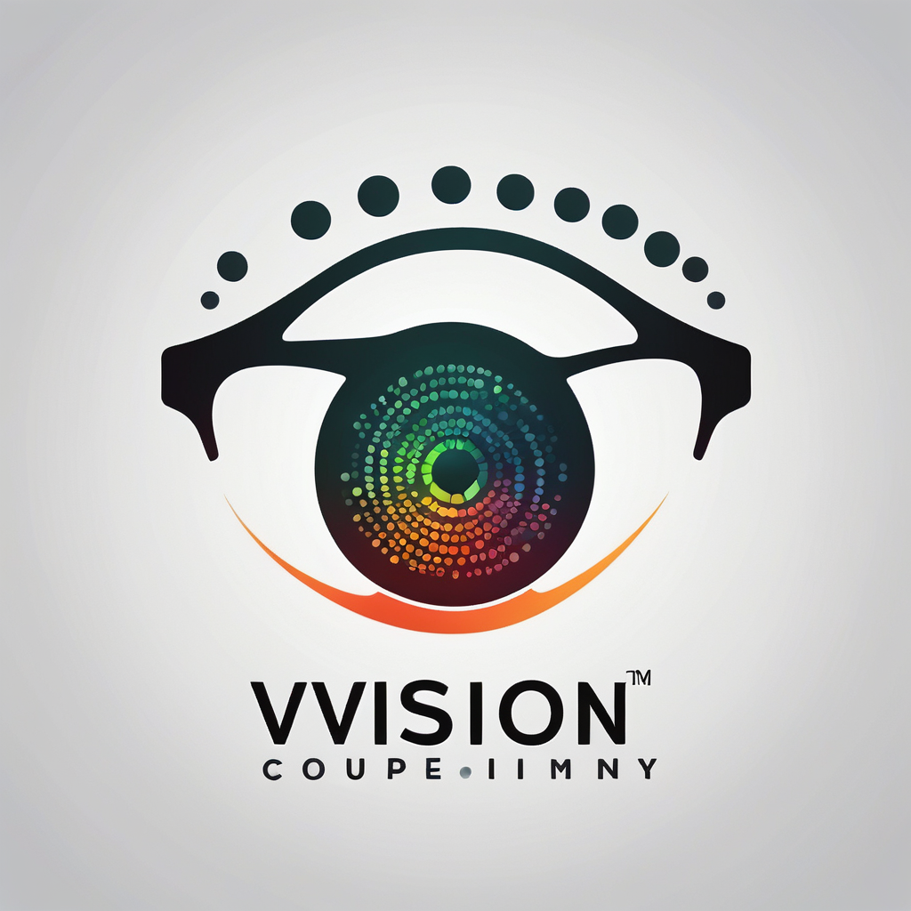

# VisionAid - Empowering Vision-Disabled Individuals



## Overview

VisionAid is an innovative solution designed to enhance the independence and safety of vision-disabled individuals. Combining cutting-edge technology with user-friendly design, VisionAid provides real-time path guidance, obstacle detection, and text recognition both indoors and outdoors. 

## Features

### Indoor Navigation
- **Path Guidance:** Two cameras in each room provide real-time navigation assistance.
- **Fall Detection:** Uses YOLO model to detect falls and notify caretakers instantly.
- **Medical Reminders:** Personalized voice reminders for medication and health check-ups.
- **Voice Assistance:** Integrated with advanced Large Language Models (LLMs) for conversational support.

### Outdoor Navigation
- **Headband with ESP-32 Camera:** Detects objects and paths using the YOLO model.
- **Walking Stick Enhancements:**
  - **Wheel for Path Traversal:** Follows the detected path for easier navigation.
  - **Ultrasonic Sensors:** Detects obstacles to prevent collisions.
  - **Pothole Detection:** Camera module identifies potholes to ensure safe walking.
- **OCR Integration:** Reads text and provides voice alerts for real-time information.

## Getting Started

### Prerequisites
- [Node.js](https://nodejs.org/)
- [React](https://reactjs.org/)
- [ESP-32](https://www.espressif.com/en/products/socs/esp32) development board

### Installation

1. **Clone the repository:**
    ```sh
    git clone https://github.com/roshnn24/AI-ComputerVision_Disable_Assistance.git
    cd AI-ComputerVision_Disable_Assistance
    ```

2. **Install dependencies:**
    ```sh
    npm install
    ```

3. **Setup the ESP-32:**
    - Follow [this guide](https://randomnerdtutorials.com/getting-started-with-esp32/) to set up your ESP-32.

4. **Run the application:**
    ```sh
    npm start
    ```

## Usage

### Indoor Navigation
1. Place cameras in each room to cover the entire area.
2. Use the companion mobile app to calibrate and set up path guidance.
3. Enjoy real-time voice guidance and fall detection notifications.

### Outdoor Navigation
1. Wear the headband with the ESP-32 camera module.
2. Use the walking stick with integrated sensors and camera.
3. Activate OCR mode by saying "Read text" and point the camera at the text.

## Contributing

We welcome contributions to enhance VisionAid! Please follow these steps:
1. Fork the repository.
2. Create a new branch (`git checkout -b feature/YourFeature`).
3. Commit your changes (`git commit -m 'Add YourFeature'`).
4. Push to the branch (`git push origin feature/YourFeature`).
5. Open a pull request.

## License

This project is licensed under the MIT License - see the [LICENSE](LICENSE) file for details.

## Contact

For questions or support, please contact:
- **Name:** R Roshaun
- **Email:** roshauninfant@gmail.com
- **GitHub:** (https://github.com/roshnn24)

---

Feel free to customize the placeholders (like `path/to/logo.png`, `yourusername`, and `your.email@example.com`) with your actual details. This README file provides a comprehensive overview, installation steps, usage instructions, and contribution guidelines to help users and developers get started with VisionAid.
